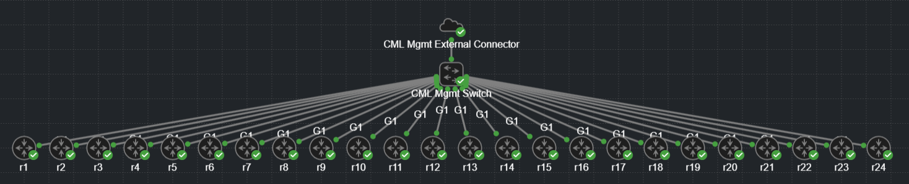

# Routers for each IOS version

This example builds on [the previous](../02_all-ios-routers/README.md) example.

Ever need to test a change or capability against a whole range of different
IOS images?  This example shows how to do that.  It also includes the code to
automate the creation pipeline using GitLab CI.

A short Ansible script is included to show using Ansible to add some additional
base configuration to the nodes.

Notable differences from the last example:

* Ansible is used to configure the routers.
* A sample gitlab-ci pipeline is provided.
* The pipeline will pause after the routers are created and configured.
* After the pause the CML topology is destroyed.
* Visual layout of the routers in CML has been improved.

## Use of 'FIXME'
There are a few places in the code where I have used 'FIXME' to indicate that
there is something that needs to be fixed.  These are typically either
configuration steps that you will need to adjust for your use case, or else
security concerns that I have not addressed.

The list of 'FIXME's is not exhaustive.

## Notes

There are times when Ansible is started before all of the routers are
completely booted.  This can cause Ansible to fail.  A quick fix is to just
re-run the Ansible stage of the pipeline.
