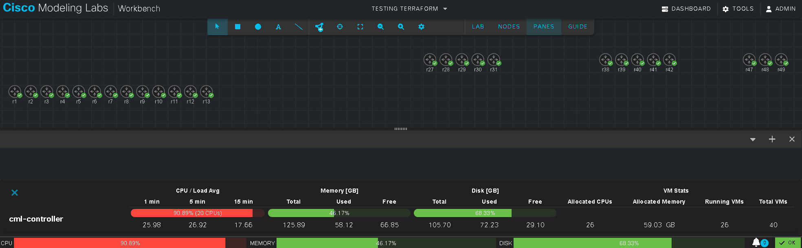

# Routers for each IOS version

Have you ever been in a situation where you needed to test code or
configuration against a list of different IOS versions?

Do you happen to have all of those IOS versions available in your CML
environment?

If so, this repository is for you!

## Use of 'FIXME'
There are a few places in the code where I have used 'FIXME' to indicate that
there is something that needs to be fixed.  These are typically either
configuration steps that you will need to adjust for your use case, or else
security concerns that I have not addressed.

The list of 'FIXME's is not exhaustive.

## Notes
It is recommended that you first review and understand the
[Routers from CSV](../routers-from-csv/) example prior to reviewing this
example.

This sample makes use of more Terraform files.  Separate files are used to
improve readability.

### On nodes and images

CML allows you to create a node definition.  That node definition can use one
or more different images.  In CML the following images exist:

- "classic" IOS for IOS 15.x is available through the ```iosv``` node type.
- IOS-XE versions 16.4.x through 16.12.x is available through the
  ```csr1000v``` node type.
- IOS-XE versions 17.1.x through 17.3.x is available through the
  ```csr1000v``` node type.
- IOS-XE versions 17.4.x through 17.15.x is available through the
  ```cat8000v``` node type.

Not all images are available by default in CML.  Some have been retired.

I cannot help you find additional images.


### When to filter

All of the filters, maps, and lists discussed in this section are generated
in the [locals.tf](./locals.tf) file.

There are two sets of routers that will be created:
1. A set of routers where filtering was applied *after* the list was generated.
   - The list of images named ```imagelist``` is created from the data source.
   - As the ```imagemap``` map is created a filter is applied.
   - The result is a non-sequential list of indexes for the images.
1. A set of routers where filtering was applied *before* the list was generated.
   - The list of images named ```imagelist``` is created from the data source.
   - A new list is created named ```filteredimagelist``` by applying the
   same filter to the list.
   - The pre-filtered list is used to create the ```prefilteredimagemap``` map.  Note that the index is sequential with no gaps.

This was done to demonstrate the importance of filtering at the right time.

## Results

There are two rows of routers created to show the difference between the
two filtering methods.  Since IPs are assigned based on the index of the
image, there would be gaps in the IP addresses for the non-sequential set.

With 26 nodes in total it took 14 minutes to complete the spin-up:

    cml2_lifecycle.top: Creation complete after 14m0s

The CPU usage looked like this:



Too slow.  The CML VM configuration was changed to faster CPUs and more of them:

    cml2_lifecycle.top: Still creating... [6m0s elapsed]
    cml2_lifecycle.top: Creation complete after 6m0s
    
    Apply complete! Resources: 28 added, 0 changed, 0 destroyed.

Once all the nodes were up the CPU usage looked like this:


## Takeaways

1. CML is resource hungry.  Rule of thumb: have one or more core per node.
1. Be careful where you choose to apply filters.

